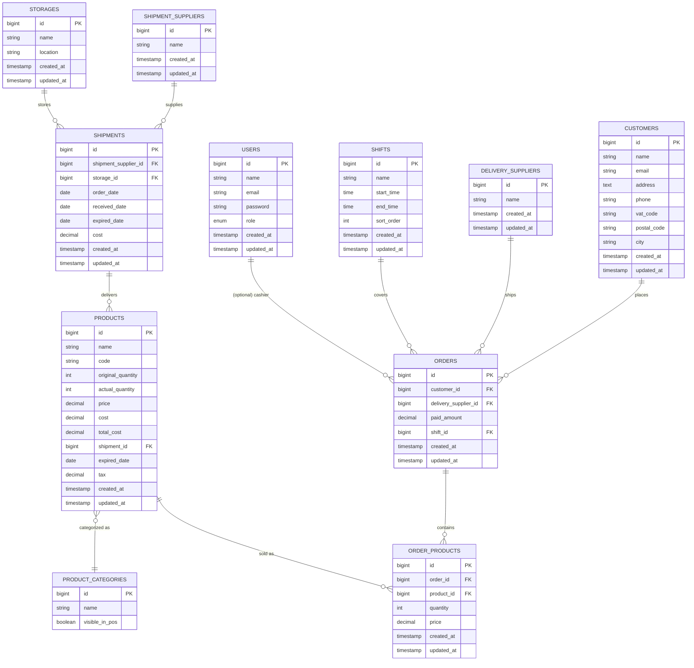

# Database ERD (Derived from Current Migrations)

This document summarizes the database schema defined by the Laravel migrations in `database/migrations`. It lists the primary entities, key columns, and foreign key relationships, then provides a Mermaid ER diagram suitable for inclusion in technical reports.

## Table Summary

- **users** — authentication and roles (`id`, `name`, `email` unique, `password`, `role` enum: admin/staff, timestamps).
- **storages** — storage locations (`id`, `name`, `location`, timestamps).
- **shipment_suppliers** — inbound suppliers (`id`, `name`, timestamps).
- **shipments** — inbound receipts (`id`, `shipment_supplier_id` FK → `shipment_suppliers.id`, `storage_id` FK → `storages.id`, `order_date`, `received_date` nullable, `expired_date` nullable, `cost` decimal, timestamps).
- **products** — catalog and stock (`id`, `name`, `code`, `original_quantity`, `actual_quantity`, `price`, `cost`, `total_cost`, `shipment_id` FK → `shipments.id`, `expired_date`, `tax`, timestamps). *(Code and indexes reference a `category_id` FK to `product_categories`, but the column is absent in the current migrations.)*
- **product_categories** — POS-facing categories (`id`, `name`, `visible_in_pos`).
- **delivery_suppliers** — outbound carriers (`id`, `name`, timestamps).
- **customers** — buyer records (`id`, `name`, `email` unique, `address` nullable, `phone` nullable, `vat_code` nullable, `postal_code` nullable, `city` nullable, timestamps).
- **orders** — sales headers (`id`, `customer_id` FK → `customers.id`, `delivery_supplier_id` FK → `delivery_suppliers.id` nullable, `paid_amount`, timestamps, `shift_id` FK → `shifts.id` nullable). *(Models reference `cashier_id` and payment breakdown fields not present in the migrations.)*
- **order_products** — line items (`id`, `order_id` FK → `orders.id`, `product_id` FK → `products.id`, `quantity`, `price`, timestamps). *(Model also expects a `tax` column not present in the migrations.)*
- **shifts** — cashier shift definitions (`id`, `name`, `start_time`, `end_time`, `sort_order`, timestamps).

## Mermaid ER Diagram

> Note: Dashed/optional relationships in the diagram (category linkage and cashier reference) reflect model/index expectations. The current migrations lack `products.category_id`, `orders.cashier_id`, and `order_products.tax`; add migrations for those columns if they are required at runtime.
