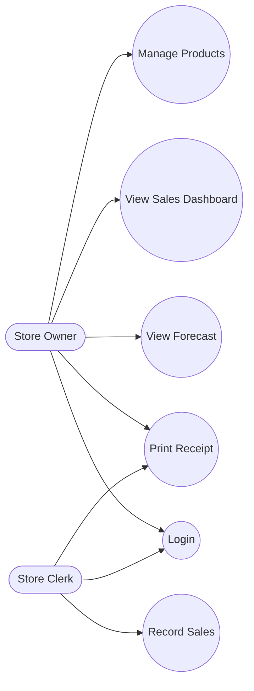
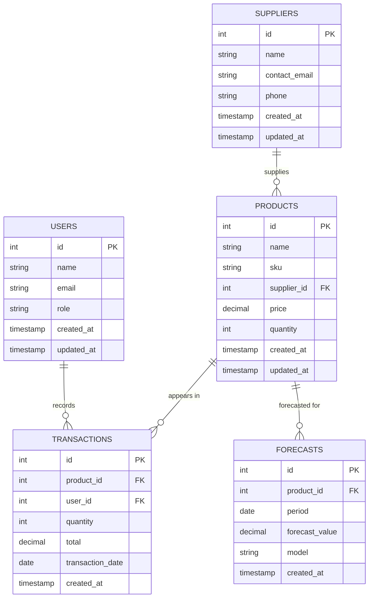
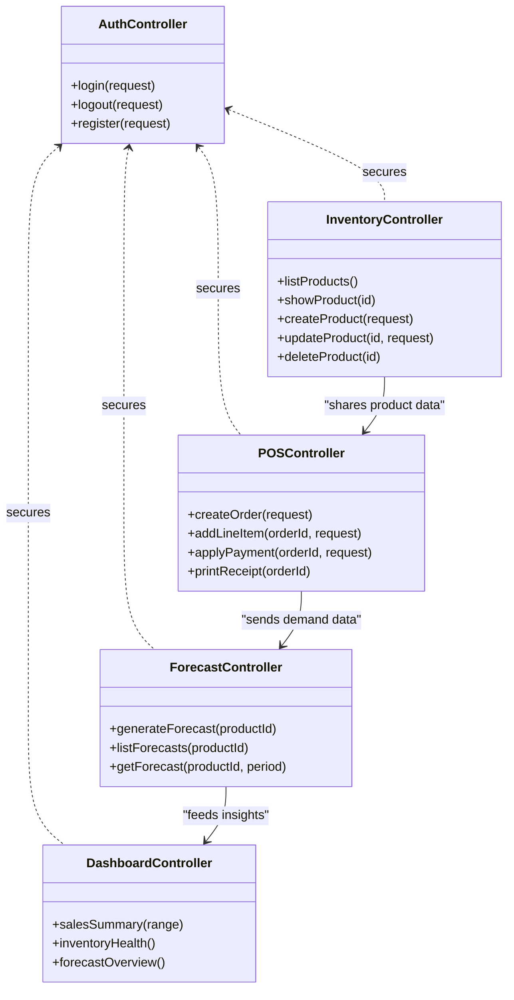
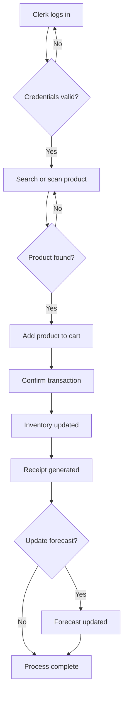

# Mermaid Diagram Templates (IMS)

Use these Mermaid snippets to embed architecture and workflow visuals for the Intelligent Inventory Management System (IMS). Each diagram is self-contained and can be copied into markdown that supports Mermaid rendering.

## 1. Use Case Diagram (Admin and Cashier)

## 2. Entity Relationship Diagram (ERD)

## 3. Class Diagram (Controller Responsibilities)

## 4. Activity Diagram (POS Workflow)

