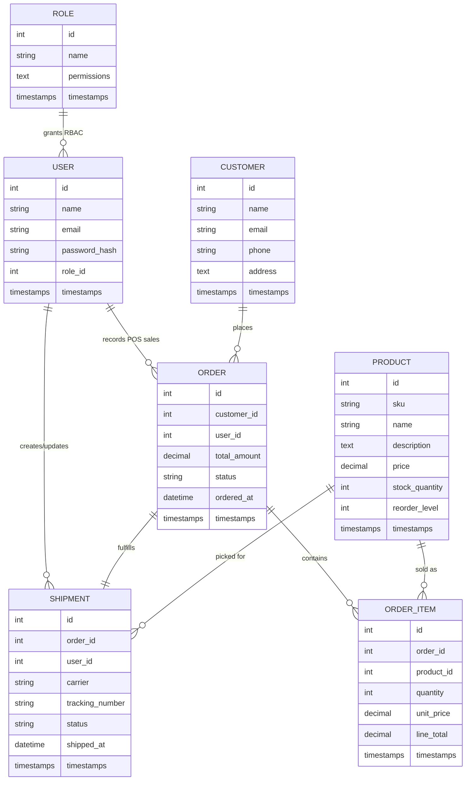
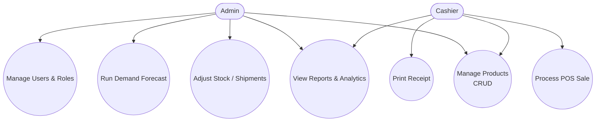

# IMS Diagrams (Mermaid)

This document provides Mermaid definitions for embedding or exporting system-level diagrams that reflect the Laravel-based inventory management system with a static HTML/CSS/JavaScript dashboard served from `public/ims-dashboard`.

## System Architecture Diagram

```mermaid
graph TD
  subgraph Client
    A[Admin / Cashier Browser]
    B[Static HTML/CSS/JS Dashboard (public/ims-dashboard)]
  end

  subgraph Edge[Edge Routing]
    C[HTTPS / Nginx]
  end

  subgraph Backend[Laravel API]
    D[Laravel Routes / Controllers]
    E[Services & Repositories\n(Inventory, POS, Analytics, Forecasting)]
    F[Validation & Middleware\n(Sanctum Auth, Rate Limits, CORS)]
  end

  subgraph Data[Persistence & Jobs]
    G[(MySQL / MariaDB)]
    H[Queue / Scheduler\n(Forecasting Jobs)]
  end

  A -->|Loads static assets| B
  B -->|Fetch / Axios requests| C
  C --> D
  D --> E
  D --> F
  E --> G
  E --> H
  F --> G
```

## Entity Relationship Diagram



## Use Case Diagram


